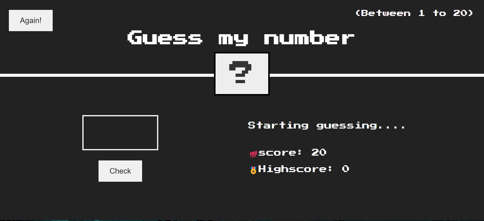

# 🎮 Number Guessing Game

A simple number guessing game built with HTML, CSS, and JavaScript. The goal is to guess a randomly generated number between 1 and 20.

## 🚀 Features

- **Random Number Generation:** Generates a random number between 1 and 20 each time the game starts.
- **User Input:** Players can enter their guesses and get instant feedback.
- **Feedback:** The game tells you if your guess is too high, too low, or correct.
- **Score Tracking:** Keeps track of how many guesses you've made.
- **Reset Button:** Start a new game anytime with a fresh random number.

## 📁 Files

- `index.html`: The main webpage.
- `style.css`: Styles for the game.
- `script.js`: Game logic.

## 🤝 Contributing

Feel free to suggest improvements or submit changes via pull requests.

## 📬 Contact

- **Email:** rahulrajsharma512@gmail.com
- **GitHub:** [rahulrajsharma1351](https://github.com/rahulrajsharma1351)
